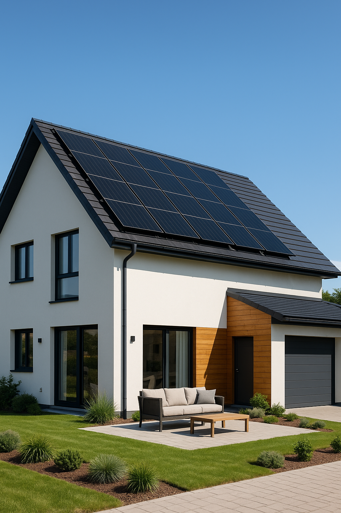
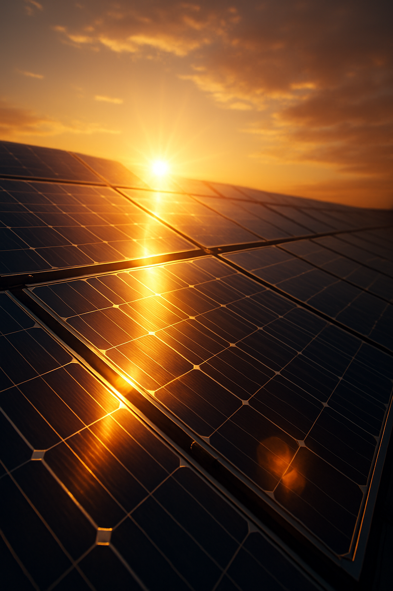

Here are two social media posts about solar panels, complete with image concepts you can use for your Canva designs. I've sized the images for standard feed posts (like Instagram or LinkedIn).

**Stop renting your electricity. Start owning it. ☀️**

Did you know that switching to solar energy isn't just about saving the planet—it's about protecting your wallet from unpredictable utility rate hikes?

With a custom solar setup, you can drastically reduce your monthly energy bills and increase the value of your home from day one. Clean energy has never looked this good.

Ready to see how much you could save? Drop a ☀️ in the comments or send us a DM for a free savings estimate!

#SolarEnergy #GoSolar #CleanEnergy #RenewableEnergy #SmartHome

**True energy independence starts on your roof. 🔋**

Power outages? Grid failures? Rising costs? When you invest in solar panels (especially paired with a battery backup), you take control of your home’s energy.

Imagine running your AC, lights, and appliances on pure sunshine, even when the grid goes down. It's not the future; it's right now.

Make the switch to reliable, clean, and independent energy today.

#EnergyIndependence #SolarPower #SustainableLiving #SolarPanels #FutureOfEnergy

